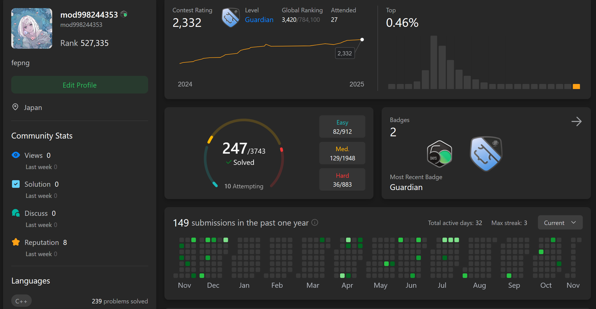
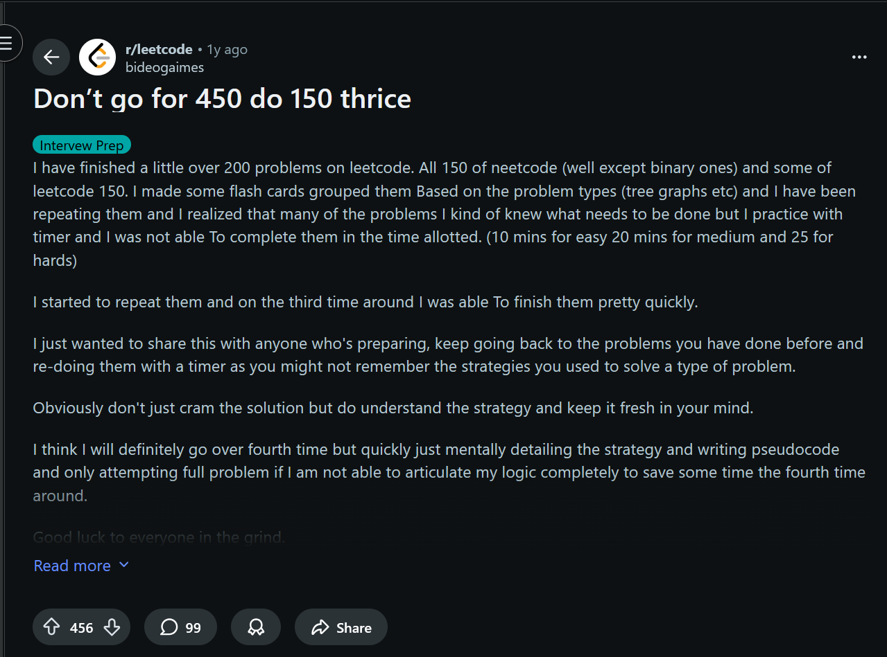
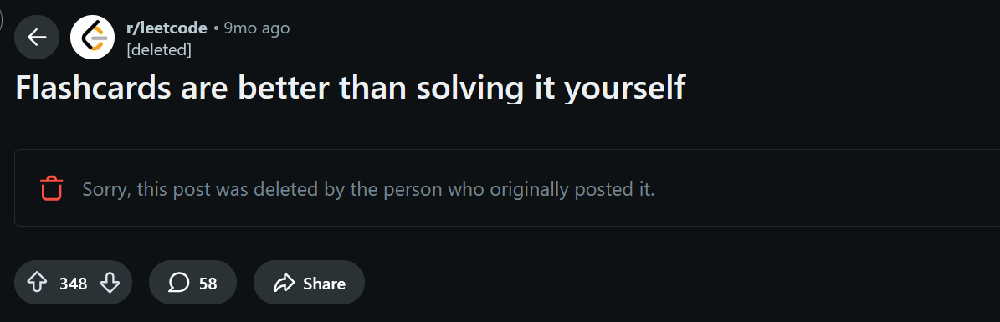
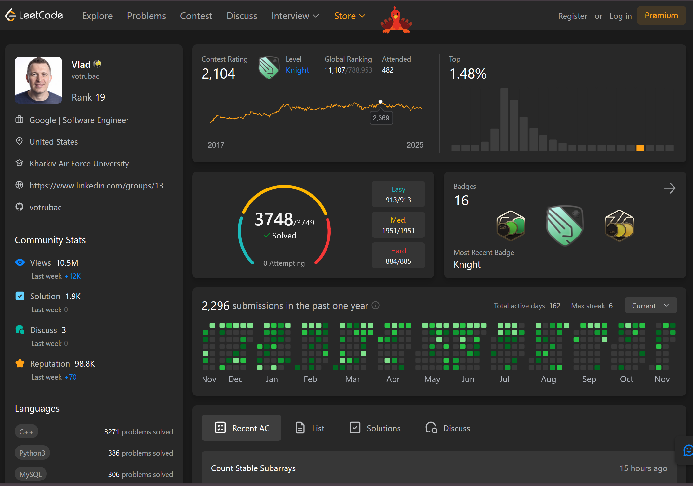
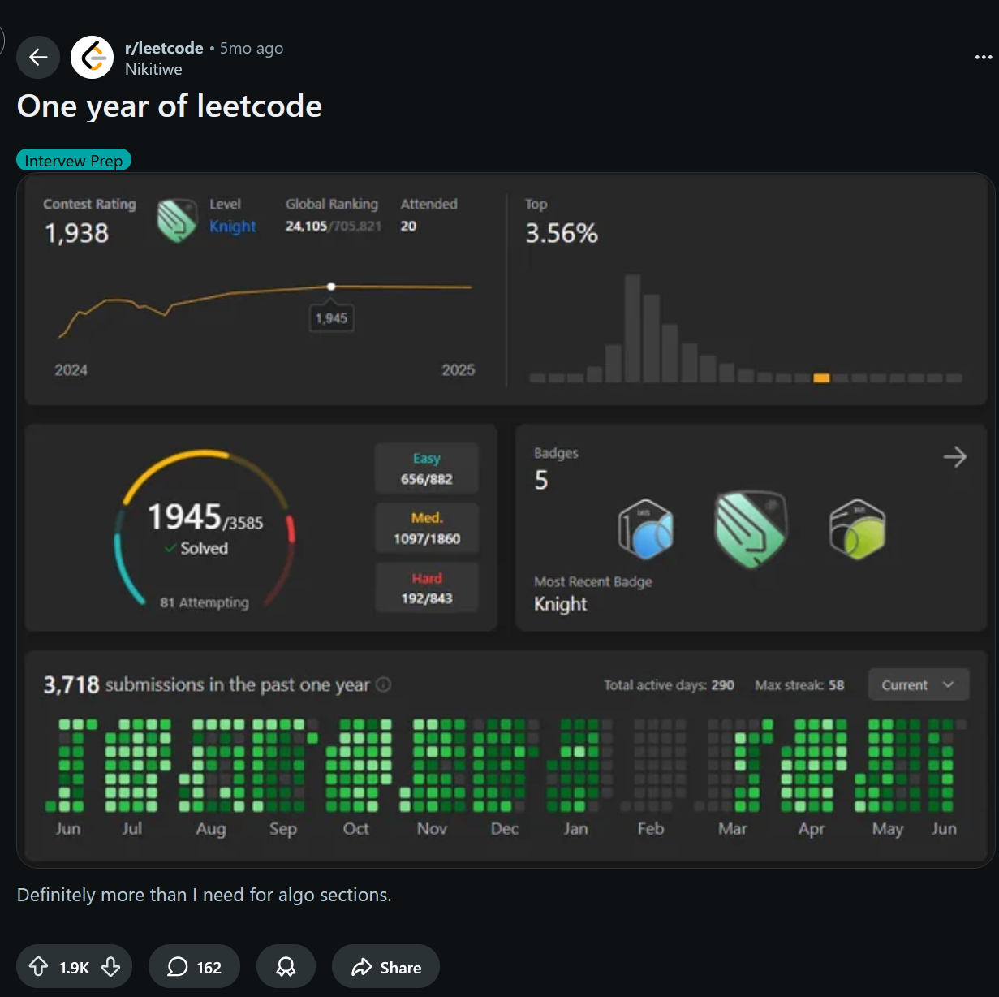

import Table from '@/components/Table.astro'
import Callout from '@/components/Callout.astro'
import copiumImg from './copium.png'

## Preface

Leetcode and DSA technical interviews for software engineer roles might be one of 
the most debated and controversial topics within the software field. This post will outline my 
opinions on how to study for such interviews, problem solving and competitive programming 
in general, coming from someone that did NOT follow the "advice" that is commonly seen.

To start, why should you care about improving in arbitary algorithmic problems? 
People seems to be averse to grinding leetcode problems, for all sorts of reasons, but a key one being
that it's useless for the job (which I'll explain why I disagree with later).

The reality is, if you want a job at a big tech company, you will be expected to pass such an interview,
and I don't expect this style of interviews to be eliminated anytime soon.
Aside from Meta and Stripe and startups that's experimenting with non-lc interviews. 
As of now in 2025, 2/3 of companies and the majority of big tech still uses DSA to filter candidates. Why?

<Callout variant="question" title="Why do companies still use DSA interviews?" defaultOpen={false}>

⚠️ **Warning:** might be controversial takes

1. **Equal playing field** — In 2025, there's more demand than supply for engineers.
These companies only need people who are "competent" enough or pass the bar. And the 
bar isn't high, so Leetcode is an easy method to filter out candidates at scale. 
Leetcode is a skill where everyone starts with the same playing field.
It's akin to a college degree which shows you're able to navigate an ambigious environment for 4 years 
and get a degree. It shows you're willing to put the bare minimum effort.
 It's also a signal of conformity and willingness to learn.

2. **It's relevant** — One common argument is that DSA interviews are utterly "irrelevant"
 to any SWE job and it's a waste of time. This is just untrue. Ask yourself why top quant companies, 
 AI labs, and big tech hire specifically ICPC or IOI medalists. 
Why is it such a strong hiring signal, if these people are just sinking thousands
of hours in arbitary puzzles that has "nothing" to do with the job? 
From personal experience, every strong competitive programmer I've ever met, also turns out 
to become a strong software engineer. They're able to solve problems under pressure, 
think critically, and are generally more competent in the software field.

{/* 3. **Merit** — If you don't conduct DSA interviews, you're essentially asking companies to only hire from top universities.
They have nothing to go off of. I've seen people argue that they have the skill
for projects, but with all the AI slop in 2025, 
I think that's even harder to prove your own skill. */}

3. **"Real-life" interviews aren't easier** — People who think they'll pass non-LC interviews if companies switch to 
"real-life" work style interviews are delusional. If they give you AI assistance and web search, there WILL be an **even stronger demand on fundamentals**. 
You'd be expected to know more: operating systems, networking, multiple languages deeply, 
system design, ambiguious problems, etc... It's not easier. 

</Callout>

I'm not suggesting that such interviews don't have it's flaws. Of course it does. 
But there has to be a compromise, and I think it's actually much easier
to prepare for than the alternative people are pushing for 
(the so-called "real-life" work and take home projects).

So what even is the purpose of this post? I've noticed that the general consensus around Leetcode
is that people simply hate it. I hope to share some different perspectives to shift that notion or at least
make the journey more tolerable. I believe the reason why most people struggle with Leetcode, is simply because they're approaching it wrong. 
This is not me coming from a high horse. There is a stark difference between what top problems solvers are doing, and what the average "advice" suggest people to do, from random 
people on the internet.

### My current skill level

I will first show my current progress, albeit by my own standards I improved
quite slowly, but objectively it has worked with great success for general technical
interviews and OAs (i.e. FAANG, quant firms, etc...). I have never needed to study 
specifically for such interviews.

<Callout variant="note" title="">
For context, I first learned about leetcode in my freshman year, but I was clueless. I was told the same thing as 
many others. "Start with Neetcode 150 and use python!". I quit after $\le$ 50 problems. 

I've only really started again in April of 2024, and I had 4 months (Jan 2025 - Apr 2025) where I didn't study at all due to military.
Overall, I've only been studying for less than 1.5 years, averaging less than 2 problems a day. 

[Leetcode](https://leetcode.com/mod998244353)

[Codeforces](https://codeforces.com/profile/shiinamashiro_)

</Callout>

## The Echo Chamber
I believe that if you learn from weak people, you'll also be weak.  I'm not strong either,
so I'm not going to come up with my own advice. Instead, this post will 
be a compilation of tips and resources from everyone I've ever met and seen that is stronger than me.

The Leetcode community is a bubble. There is a severe disconnect between Leetcode-only users
 and people who've been properly exposed to the entire problem solving community. What do I mean by that?

**1. The advice you commonly see is from people who haven't succeeded themselves**

Most advice on Reddit or random blogs comes from people who are stuck at
 the same level as you. They're regurgitating what they read from someone else
  who also never got good. It's blind leading the blind.

**2. The echo chamber reinforces memorization over understanding**

There's advice like this with a lot of upvotes which can completely ruin your chances of success
as a beginner.

<Callout variant="warning">

</Callout>

This creates a cycle where people think problem solving is about
memorizing patterns instead of **understanding**. They never learn to solve problems 
 they haven't seen before. Let me be very clear because a lot of people take this the wrong way.
There is a difference between recognizing a pattern and memorizing a pattern. Take binary search 
for example. You should be able to explain exactly why `r = mid - 1` and `l = mid + 1` 
or whether to use `while (l <= r)` instead of `while (l < r)`. No one is asking your to "invent"
things on the spot, but having an immaculate understanding to the point where you barely
have to think about the details when implementing is what you should be aiming for.

**3. There's a fundamental misunderstanding of what "practice" means**

In the broader problem solving community, no one tells you to "redo the same 150 problems until you memorize them." That would be insane. But somehow in the Leetcode space, this is normalized and even encouraged.

**Real practice is:**
- Solving new problems consistently
- Generalizing patterns across different problem types
- Building actual problem-solving skills

I will elaborate more on this in the next section.

**4. The platforms matter more than people realize**

Most people stick to Leetcode exclusively because it's what everyone talks about.
 But the competitive programming community has been around much longer and has
  **significantly better resources**:

- Atcoder's beginner contests are easier to get started than LC easies
- USACO and CSES have much better topic-based training than any "roadmap" you can ever find
- Editorials from competitive programming sites are written by authors, often master+ rated. Leetcode
solutions are often written by troglodytes or AI generated farming upvotes.
- A lot of problems forces you to think more and apply patterns in creative ways. 
It's less standard, which helps you build problem solving skills.

To me, Leetcode is a subset of competitive programming. Competitive programming has both a lower 
floor and a higher ceiling. 

There's a LOT of misconceptions about competitive programming, and I'll address some of them later. 

- It's not only math
- It's not for geniuses, chinese elementary and middle schoolers are doing codeforces 
- It translates to leetcode very well, but not vice versa
- It's not a waste of time, it's a skill that will help you in your career
- It does not take more time
- You can use python... any language you want

**5. The metrics people care about are wrong**

Leetcode users obsess over:
- Total problems solved
- Streak counts / Consistency
- Company tags 
- Premium subscription features 

<Callout variant="note" title="Questionable metrics" defaultOpen={false}>
Things like this gets applauded on reddit and youtube.

Shouldn't the goal be to achieve more with less effort? I would be ashamed if I solved 3000 problems 
and is not guardian rating. btw, this guy is a cheater and still did not get banned.

</Callout>

Instead you should care about:
- Rating / contest performance (not the best but still more accurate than problems solved)
- Solving progressively harder problems
- Actual skill development

## How to actually improve
### Learning from the right sources

<Callout variant="warning" title="Popular Leetcode Influencers vs Competitive Programming Influencers">

Let's look at the hard numbers. These are the people whose tutorials get millions of views:

<Table
  headers={['Content Creator', 'LeetCode Rating', 'Codeforces Rating', 'Last Active Improvement']}
  rows={[
    ['NeetCode', '1700', '~1000', '5+ years ago (stopped improving and sold courses)'],
    ['Nick White', '~1600', 'N/A', 'Stagnant'],
    ['TLE Eliminators (Priyansh Agarwal)', '~2500-2900', '~1800-2100', 'Stagnant (only reached 2188 once, and instantly quit to sell courses)'],
    ['Most other LC YouTubers', '1600-1800', 'N/A', 'N/A'],
    ['Most Top Upvoted Solutions', '1600-1800', '~800-1000', 'N/A (likely AI-generated farming upvotes)'],
  ]}
/>

For context, the formula for converting CF to LC rating is roughly:

$$lc \approx cf + 800$$

Now compare this to resources from the competitive programming community:

<Table
  headers={['Resource', 'LeetCode Rating', 'Codeforces Rating', 'Achievements']}
  rows={[
    [{ text: 'USACO Guide (benq)', href: 'https://usaco.guide' }, '~3800+', '3738', 'Literally #1 on Codeforces.'],
    [{ text: 'twwilliamlin', href: 'https://youtu.be/bVKHRtafgPc?si=g5cqmIalo95XOPvg' }, '3312', '2931', 'Popular for his interview vid'],
    [{ text: 'Errichto', href: 'https://www.youtube.com/@Errichto' }, '~3800+', '3053', 'Popular competitive programming YouTube channel.'],
    ['Codeforces / Atcoder Editorials (Problem setters and LGMs)', '~3000+', 'Often 2400+', 'IOI/ICPC medalists.'],
  ]}
/>
</Callout>

**It's incomprehensible why anyone would choose to learn from people at 1700 rating and buy their courses for hundreds of USD when there are FREE resources written by the literal #1 ranked competitive programmer in the world.**

A common counterargument is that this is for training "competitive programming", not interviews. 
Trust me that is not the case as I've mentioned. The problem solving aspect is completely transferrable.

### Get out of leetcode

My study strategy is simple: **get people out of the leetcode grind as fast as possible.**

Don't follow the masses. Don't spend years stuck in the same cycle that everyone else is suffering through.

People like [coding jesus](https://www.youtube.com/@coding_jesus) advocate for not doing Leetcode at all.
 I disagree because that's just the reality of the system right now. Algorithmic interviews exist, and you need to pass them.

**But here's what I do agree with:** People shouldn't be spending MORE than 1/3 of their study time on Leetcode-specific prep, yet I see countless new grads grinding 8 hours a day exclusively on Leetcode. That's insane. That's the problem.

Build the actual skill. Learn from people who are actually strong. Then Leetcode becomes trivial.

## How to actually improve

I think many people overthink this. The formula is simple:

- **Volume**: Solve enough problems consistently
- **Difficulty**: Push yourself slightly beyond your comfort zone
- **Variety**: Mix standard topics with ad-hoc thinking problems

That's it. You don't need a magic formula or a paid course.

### Recommendations

**Topic Archive:**
- USACO > CSES

**Active Problem Lists:**
- Atcoder > Codeforces > Kattis > Leetcode

<Callout variant="remark">

"But these are competitive programming sites!"

The best resources FOR INTERVIEWS are still Atcoder and topic-based platforms like USACO, despite some people avoiding them because "interviews aren't competitive programming."

Having done both, **they're really the same thing**: solving problems under time pressure.

</Callout>

### Why Competitive Programming Sites?

Atcoder has **extremely beginner-friendly problems** and editorials that teach you syntax. The stereotype that competitive programming is "harder" or "all maths" is a misconception.

**It has both:**
- A lower floor of entry
- A higher ceiling to master

If some topic you think doesn't matter for interviews? Skip it. You're in control.

## Common Beginner Questions

<Callout variant="question" title="What language should I use?">

It doesn't matter unless you're picking something like JavaScript.

</Callout>

<Callout variant="question" title="How long should I attempt before reading the editorial?">

It depends. Do whatever your gut feeling tells you.

</Callout>

<Callout variant="question" title="What topics should I learn first?">

Doesn't matter as long as you can learn it.

</Callout>

<Callout variant="question" title="Will solving X problems get me to X rating?">

Don't ask this. No one knows aside from yourself.

</Callout>

### Readings

[This post by LGM umnik](https://codeforces.com/blog/entry/98806) includes many things that worked for me. Give it a read.

### Self-Deception
I can't explain it better than is-this-fft. Just read this blog — it will save you **A LOT** of wasted time:

[Stop Self-Deception](https://codeforces.com/blog/entry/98621)

### Overkill
"Competitive programming is overkill for interviews"

It's really not because most average leetcode grinders cannot confidently solve every single 
interview problem or OA thrown at them. If you can go from a 50% success rate to 90% success rate
you're essentially doubling your chances of getting an offer.

### Time
"This advice only works for students and not for working professionals"

<Callout variant="remark">

**Lack of time is almost always a personal issue**. If you care about something enough, you will create time for it.

</Callout>

But there's a deeper misconception here about time that I want to address.

**The Misconception:** "Doing competitive programming or following your approach takes MORE time than just grinding Leetcode."

**The Reality:** Over the long term, you actually spend LESS time.

Think about it:

If you take the memorization route:
1. Study Neetcode 150 before interview season
2. Get a job
3. Get laid off or want to job hop
4. **Re-study Neetcode 150 again** because you forgot everything
5. Repeat this vicious cycle every time you need to interview

**You're wasting SO MUCH TIME.**

If you study properly from the start:
- You build actual problem-solving skills
- You get strong enough that you don't need to "prep" for interviews
- When you need to interview, you can just... interview
- No more re-studying the same 150 problems every year

## Enjoyment

**If you enjoy something, you will learn that thing faster.** You will subconsciously retain information better.

Make this journey as comfortable and fun as possible.

I get it — not everyone enjoys leetcode or competitive programming. But I think there are many factors:

- Getting influenced by negative voices on r/leetcode or peers
- Not giving different methods a try
- Only sticking with mainstream study methods (like sheets)
---

*What are your thoughts? Reach out if you'd like to discuss — I'm always happy to hear different perspectives.*
