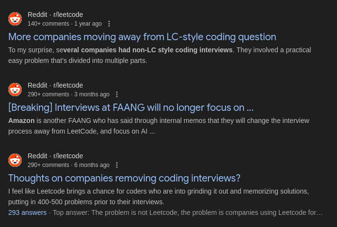

import Callout from '@/components/Callout.astro'
import copiumImg from './copium.png'

## Preface

Leetcode and DSA technical interviews within the software field might be one of the most debated topics within the software field. This is my philosophy on how to
approach things like Leetcode and problem solving in general.

To start, why should you care? Every three months I see a coping post saying 
that companies are moving away from Leetcode style interviews--

Unfortunately, they're not. And I don't expect this style of interviews to be eliminated anytime soon. Aside from Meta and Stripe and a few companies that's experimenting with non-lc interviews. 
As of now in 2025, 2/3 of companies and the majority of big tech still uses DSA to filter candidates. Why?

<Callout variant="question" title="Why do companies still use DSA interviews?">

⚠️ **Warning:** might be controversial takes

1. **Equal playing field** — In 2025, there's more demand than supply for engineers. These companies only need people who are "competent" enough or pass the bar. And the bar isn't high. For companies, it's also easy to conduct such interviews at scale. Leetcode is a skill where everyone essentially starts with the same playing field. It's like a game. It shows you're willing to put the bare minimum effort, and that you could learn a new skill.

2. **It's relevant** — One common argument is that Leetcode is utterly "irrelevant"
 to any SWE job and it's a waste of time. This is just untrue. Ask yourself why top quant companies, 
 AI labs, and big tech hire specifically ICPC or IOI medalists. 
Why is it such a signal for prestige, if these people are just sinking thousands
 of hours in arbitary puzzles that has "nothing" to do with the job? 
 Well, maybe because it does help: debugging skills, critical thinking skills,
ability to break complex problems down.

{/* 3. **Merit** — If you don't conduct DSA interviews, you're essentially asking companies to only hire from top universities.
They have nothing to go off of. I've seen people argue that they have the skill
for projects, but with all the AI slop in 2025, 
I think that's even harder to prove your own skill. */}

3. **"Real-life" interviews aren't easier** — People who think they'll pass non-LC interviews if companies switch to 
"real-life" work style interviews are delusional. If they give you AI assistance and web search, there WILL be an **even stronger demand on fundamentals**. 
You'd be expected to know more: operating systems, networking, multiple languages deeply, 
system design, ambiguious problems, etc... It's not easier. 

</Callout>

I'm not suggesting that such interviews don't have it's flaws. Of course it does. 
But there has to be a compromise, and I think it's much easier
to prepare for than the alternative people are pushing for (the so-called "real-life" work and take home projects).

So what even is the purpose of this post? I've noticed that the general consensus around Leetcode
is that people simply hate it. I hope to share some different perspectives to shift that notion or at least
make the journey more tolerable. I believe the reason why most people struggle with Leetcode, is simply because they're approaching it wrong. 
This is not me coming from a high horse. There is a stark difference between what top problems solvers are doing, and what the average "advice" suggest people to do, from random 
people on the internet. 

### Where I'm at

I will first show my current progress, albeit by my own standards I improved
quite slowly, but objectively it has worked with great success for general technical
interviews and OAs (i.e. FAANG, quant firms, etc...). I have never needed to study 
specifically for such interviews.

<Callout variant="note" title="My current profiles">
For context, I first learned about leetcode in my freshman year, but I was clueless. I was told the same thing as 
many others. "Start with Neetcode 150 and just use python!". I quit after $\le$ 50 problems. 

I've only really started again in April of 2024, and I had 4 months (Jan 2025 - Apr 2025) where I didn't study at all due to mandatory military conscription.
Overall, I've only been studying for less than 1.5 years, averaging less than 2 problems a day. 

[Leetcode](https://leetcode.com/mod998244353)

[Codeforces](https://codeforces.com/profile/shiinamashiro_)

</Callout>

## The Echo Chamber
I believe that if you learn from weak people, you'll be weak.  I'm not strong either, so I'm not going to come up with my own advice. Instead, this blog will 
be a compilation of tips and resources from everything I've learned within my limited experience, from IOI medalists to ICPC finalists, LGMs on codeforces,
and all my friends that are stronger than me.  

There is a severe disconnect between Leetcode-only users and people who's
been properly exposed to the entire problem solving community. What do I mean by that?
Here's a couple points to think about:

## Misconceptions

### "You need to grind 8 hours a day for years"

This is probably the biggest misconception. You don't need to sacrifice your entire life to get good at problem solving.

The key isn't the hours — it's the **quality** and **consistency**. I've seen people solve 2000+ problems on LeetCode and still struggle with medium problems. I've also seen people solve 500 problems properly and become strong.

**You don't need insane effort. You need consistent, focused effort.** 
## How to Improve

I think many people overthink this. The formula is simple:

- **Volume**: Solve enough problems consistently
- **Difficulty**: Push yourself slightly beyond your comfort zone
- **Variety**: Mix standard topics with ad-hoc thinking problems

That's it. You don't need a magic formula or a paid course.

### My Recommendations

**Topic Archive:**
- USACO > CSES

**Active Problem Lists:**
- Atcoder > Codeforces > Kattis > Leetcode

<Callout variant="remark">

"But these are competitive programming sites!"

The best resources FOR INTERVIEWS are still Atcoder and topic-based platforms like USACO, despite some people avoiding them because "interviews aren't competitive programming."

Having done both, **they're really the same thing**: solving problems under time pressure.

</Callout>

### Why Competitive Programming Sites?

Atcoder has **extremely beginner-friendly problems** and editorials that teach you syntax. The stereotype that competitive programming is "harder" or "all maths" is a misconception.

**It has both:**
- A lower floor of entry
- A higher ceiling to master

If some topic you think doesn't matter for interviews? Skip it. You're in control.

## Common Beginner Questions

<Callout variant="question" title="What language should I use?">

It doesn't matter unless you're picking something like JavaScript.

</Callout>

<Callout variant="question" title="How long should I attempt before reading the editorial?">

It depends. Do whatever your gut feeling tells you.

</Callout>

<Callout variant="question" title="What topics should I learn first?">

Doesn't matter as long as you can learn it.

</Callout>

<Callout variant="question" title="Will solving X problems get me to X rating?">

Don't ask this. No one knows aside from yourself.

</Callout>

### Required Reading

[This post by LGM umnik](https://codeforces.com/blog/entry/98806) includes many things that worked for me. Give it a read.

## How to Avoid Useless Studying

This is **the most important concept** that many people fail on.

### 1. Repetition

<Callout variant="warning">

It's fine to do repetition on the **TOPIC level**, but not on the **PROBLEM level**, unless you completely forgot how to solve it.

</Callout>

I see people recommending:
- Repeating sheets like "Don't do 450, do 150 thrice"
- Using flashcards to recall techniques for each problem

**NO!** This is not a memorization game. You should be able to figure out the techniques yourself, without having seen it before. You apply pattern recognition from past standard problems, then apply it to brand new problems.

### 2. Self-Deception

I can't explain it better than is-this-fft. Just read this blog — it will save you **A LOT** of wasted time:

[Stop Self-Deception](https://codeforces.com/blog/entry/98621)

### 3. Efficiency

**Know how to maximize your time.** Don't spend 5 hours on a problem that's way outside your level.

This is why I think leetcode contests (arguably CF too for Div 2 or higher) are one of the worst places for beginners:

1. Difficulty gaps are too large
2. You solve the first two problems
3. Q3 and Q4 are so much harder
4. You force yourself to upsolve after 4 hours
5. **You still learned absolutely nothing**

<Callout>

If you can upsolve contests, that's amazing — but solve problems **within reach**. Don't do problems where you don't even have a clue how to start. You're probably not prepared for them yet.

</Callout>

## Common Counterarguments

### "Competitive programming is not needed for interviews"

<Callout variant="warning">

If you think all you need is memorizing leetcode problems, hoping you roll the dice until you get an interview with a problem you memorized, or you believe that problem solving is "dumb and useless" — this isn't for you.

</Callout>

I'm a strong believer that **problem solving is an essential skill**. If you study DSA properly, regardless of how "irrelevant" the material is, the skills you build will translate to a job one way or another.

**I noticed:** People who complain about DSA being useless mostly never got good at DSA themselves and tried memorizing. Of course they felt like they learned nothing.

### The Fairness of Technical Interviews

To me, **leetcode-style interviews are as fair as they get** without undermining the efficiency of hiring.

- No one is good at leetcode at the start
- It sets an **equal playing field**
- Those who spend time and effort can rise and prove themselves

<Callout>

Without leetcode, companies like FAANG would **only hire from top 50 US universities**. No one else would have a chance.

</Callout>

Of course companies want the best. If you're not getting into FAANG, it means other people demonstrated **your skill, and more**.

### Why Companies Love Competitive Programmers

I don't think I have to explain why quant firms or FAANG love competitive programmers:

- Extremely competent with software development
- Great at debugging
- Fast thinkers
- Natural tendency to solve problems themselves

**No**, you don't need competitive programming to join these companies. But I personally think it's an amazing tool if you're willing to spend the effort.

### "We don't have that much time due to work or study"

<Callout variant="remark">

Trust me, **lack of time is always a personal issue**. If you care about something enough, you will create time for it.

</Callout>

## Enjoyment

**If you enjoy something, you will learn that thing faster.** You will subconsciously retain information better.

Make this journey as comfortable and fun as possible.

I get it — not everyone enjoys leetcode or competitive programming. But I think there are many factors:

- Getting influenced by negative voices on r/leetcode or peers
- Not giving different methods a try
- Only sticking with mainstream study methods (like sheets)

## My Thoughts on Leetcode

I started on Leetcode, so I don't think Leetcode is bad as a website.

**However, there are traps:**

❌ Paying for premium because you think it'll make you motivated  
❌ Needing autocomplete or company-specific problems  
❌ Memorizing problems (subconsciously too)  
❌ Reading AI-generated or terrible solutions  
❌ Buying courses elsewhere  

**None of the above will make you strong.**

### The "Beginner Cycle"

From experience, I notice **a lot more leetcode-only users get stuck** in the "beginner cycle":

1. Revisit the same problems or topics over and over
2. Only solve from the top 200 common problems
3. This type of studying is bland, if not frustrating
4. Burnout happens
5. Stop for a couple months
6. Reality hits — need to study again
7. Come back and cycle repeats

### How to Avoid This

**Take things slow.** Don't set unrealistic goals or daily quotas and bash yourself for not reaching them.

The journey has to be **comfortable and enjoyable**.

<Callout variant="insight">

The competitiveness of contests and accomplishment of solving difficult problems is what makes this sport fun for me. Not a chore I have to do because I need a job.

**That mindset shift changes everything.**

</Callout>

## My Goal

My goal is **long-term**: to generalize concepts and patterns enough so that any problem thrown at me can be solved easily. Not to treat each problem as an individual entity.

I've heard many stories about people:
- Getting laid off
- Having to re-visit neetcode 150 or study every time they need a job hop

<Callout>

**If you're strong, you don't have to do any of that.**

Over the long term, this approach saves time.

</Callout>

## Conclusion

Problem solving is a skill. Like any skill, it requires:

1. **Consistent practice** (not cramming)
2. **Proper difficulty progression** (not too hard, not too easy)
3. **Variety** (not memorization)
4. **Enjoyment** (not torture)

The people who succeed are those who treat this as a long-term investment in their abilities, not a short-term checkbox for interviews.

Build the skill. The interviews will follow.

---

*What are your thoughts? Reach out if you'd like to discuss — I'm always happy to hear different perspectives.*
