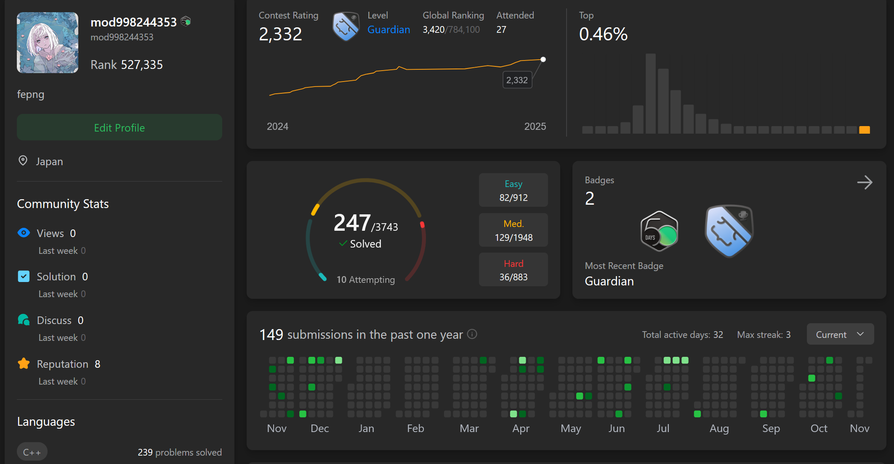
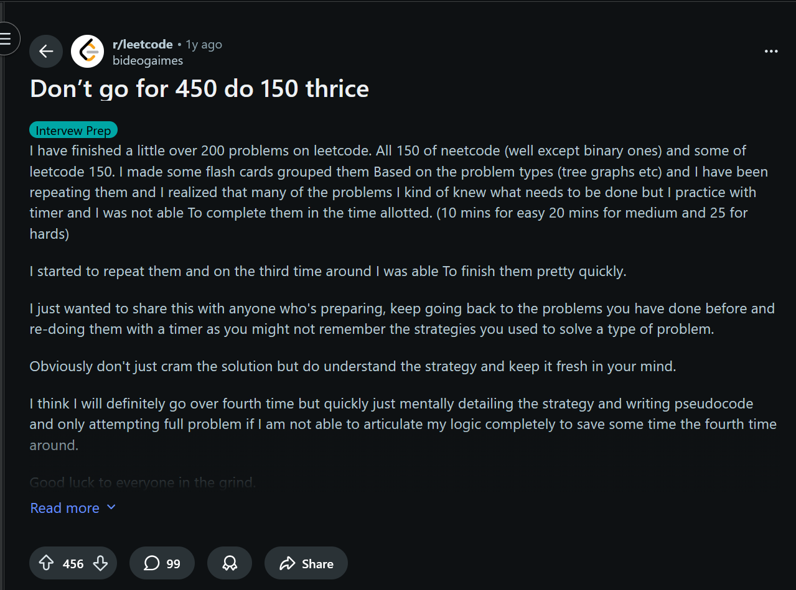
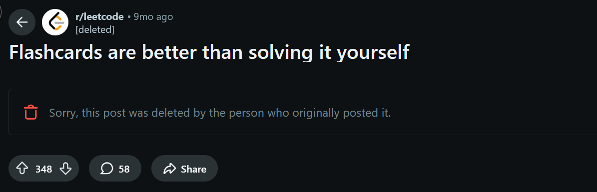
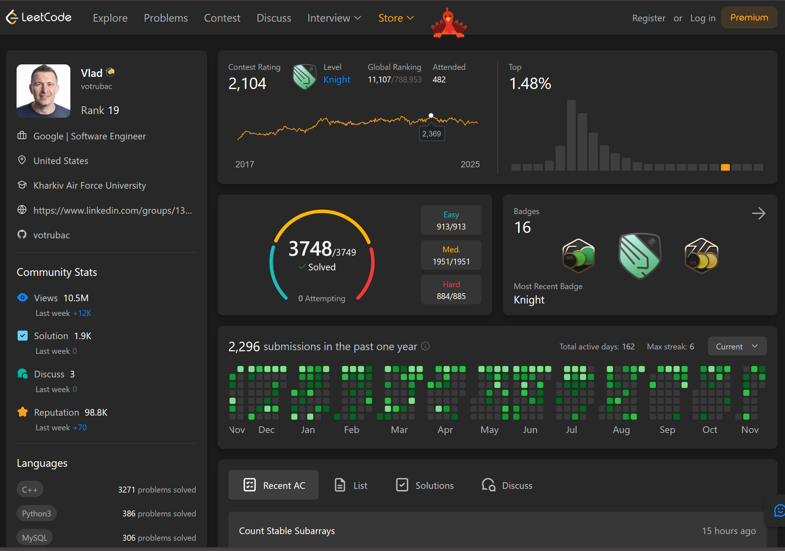
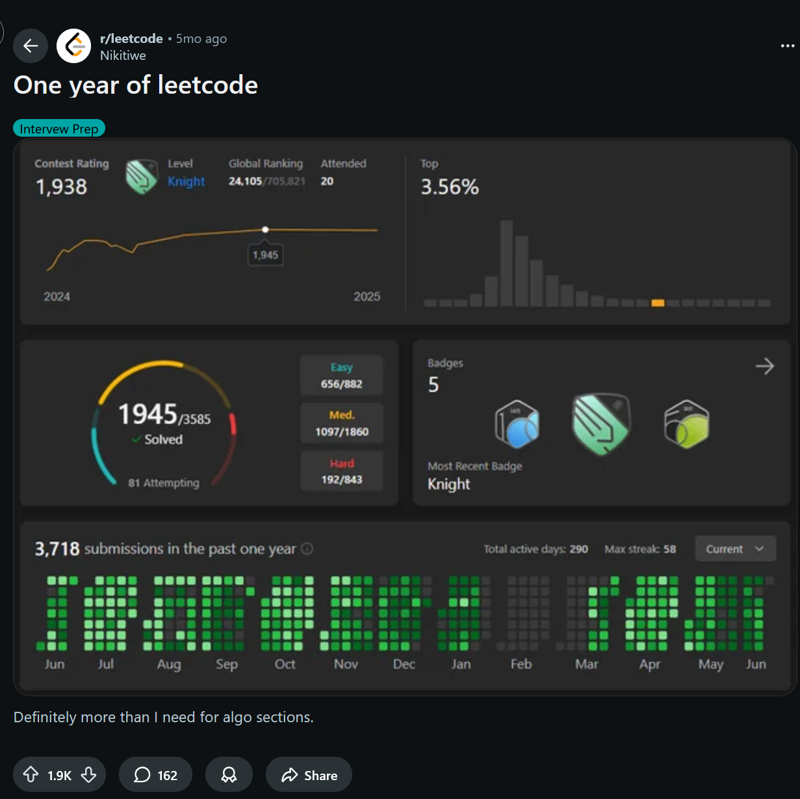

import Table from '@/components/Table.astro'
import Callout from '@/components/Callout.astro'
import copiumImg from './copium.png'
import Link from '@/components/Link.astro'

## Preface

Leetcode and DSA technical interviews for software engineer roles might be one of 
the most debated and controversial topics within the software field. This post will outline my 
opinions on how to study for such interviews, problem solving and competitive programming 
in general, coming from someone that did NOT follow the "advice" that is commonly seen.

To start, why should you care about improving in arbitary algorithmic problems?
People seems to be averse to grinding leetcode problems, for all sorts of reasons, but a key one being
that it's useless for the job (which I'll explain why I disagree with later).

The reality is, if you want a job at a big tech company, you will be expected to pass such an interview,
and I don't expect this style of interviews to be eliminated anytime soon.
Aside from Meta and Stripe and startups that's experimenting with non-lc interviews. 
As of now in 2025, 2/3 of companies and the majority of big tech still uses DSA to filter candidates. Why?

<Callout variant="question" title="Why do companies still use DSA interviews?" defaultOpen={false}>

⚠️ **Warning:** might be controversial takes

1. **Equal playing field** — In 2025, there's more demand than supply for engineers.
These companies only need people who are "competent" enough or pass the bar. And the 
bar isn't high, so Leetcode is an easy method to filter out candidates at scale. 
Leetcode is a skill where everyone starts with the same playing field.
It's akin to a college degree which shows you're able to navigate an ambigious environment for 4 years 
and get a degree. It shows you're willing to put the bare minimum effort.
 It's also a signal of conformity and willingness to learn.

2. **It's relevant** — One common argument is that DSA interviews are utterly "irrelevant"
 to any SWE job and it's a waste of time. This is just untrue. Ask yourself why top quant companies, 
 AI labs, and big tech hire specifically ICPC or IOI medalists. 
Why is it such a strong hiring signal, if these people are just sinking thousands
of hours in arbitary puzzles that has "nothing" to do with the job? 
From personal experience, every strong competitive programmer I've ever met, also turns out 
to become a strong software engineer. They're able to solve problems under pressure, 
think critically, and are generally more competent in the software field.

{/* 3. **Merit** — If you don't conduct DSA interviews, you're essentially asking companies to only hire from top universities.
They have nothing to go off of. I've seen people argue that they have the skill
for projects, but with all the AI slop in 2025, 
I think that's even harder to prove your own skill. */}

3. **"Real-life" interviews aren't easier** — People who think they'll pass non-LC interviews if companies switch to 
"real-life" work style interviews are delusional. If they give you AI assistance and web search, there WILL be an **even stronger demand on fundamentals**. 
You'd be expected to know more: operating systems, networking, multiple languages deeply, 
system design, ambiguious problems, etc... It's not easier. 

</Callout>

I'm not suggesting that such interviews don't have it's flaws. Of course it does. 
But there has to be a compromise, and I think it's actually much easier
to prepare for than the alternative people are pushing for 
(the so-called "real-life" work and take home projects).

So what even is the purpose of this post? I've noticed that the general consensus around Leetcode
is that people simply hate it. I hope to share some different perspectives to shift that notion or at least
make the journey more tolerable. I believe the reason why most people struggle with Leetcode, is simply because they're approaching it wrong. 
This is not me coming from a high horse. There is a stark difference between what top problems solvers are doing, and what the average "advice" suggest people to do, from random 
people on the internet.

### My current skill level

I will first show my current progress, albeit by my own standards I improved
quite slowly, but objectively it has worked with great success for general technical
interviews and OAs (i.e. FAANG, quant firms, etc...). I have never needed to study 
specifically for such interviews.

<Callout variant="note" title="">
For context, I first learned about leetcode in my freshman year, but I was clueless. I was told the same thing as 
many others. "Start with Neetcode 150 and use python!". I quit after $\le$ 50 problems. 

I've only really started again in April of 2024, and I had 4 months (Jan 2025 - Apr 2025) where I didn't study at all due to military.
Overall, I've only been studying for less than 1.5 years, averaging less than 2 problems a day. 

[Leetcode](https://leetcode.com/mod998244353)

[Codeforces](https://codeforces.com/profile/shiinamashiro_)

</Callout>

## The Echo Chamber
There's these ex-FAANG engineers coming out to sell DSA courses cause they're better at building a business and marketing and being a creator.
They're generally not top tier problem solvers or being a good software engineer, that's why they left to build their brand.
I believe what's happening in the Leetcode community, is that people are stuck in an endless loop of listening to these people, and getting stuck. 

The Leetcode community is a bubble. There is a severe disconnect between Leetcode-only users
and people who've been properly exposed to the entire problem solving community. What do I mean by this?

### 1. Advice you commonly see comes from people who haven't succeeded themselves

Most advice on Reddit or random blogs comes from people who are stuck at
the same level as you. They're regurgitating what they read from someone else
who also never got good. It's blind leading the blind.

Go click on 10 user editorials right now for the daily problem. It's likely written by AI, or
outdated, or written by someone less than 2000 rating (or no rating at all!). 

### 2. Memorization over understanding
There's advice like this with a lot of upvotes which can completely ruin your chances of success
as a beginner.

<Callout variant="warning">

</Callout>

This creates a cycle where people think problem solving is about
memorizing patterns instead of **understanding**. They never learn to solve problems 
 they haven't seen before. Let me be very clear because a lot of people take this the wrong way.
There is a difference between recognizing a pattern and memorizing a pattern. Take binary search 
for example. You should be able to explain exactly why `r = mid - 1` and `l = mid + 1` 
or whether to use `while (l <= r)` instead of `while (l < r)`. No one is asking your to "invent"
things on the spot, but having an immaculate understanding to the point where you barely
have to think about the details when implementing is what you should be aiming for.

### 3. Misunderstanding of what "practice" means

In the broader problem solving community, no one tells you to "redo the same 150 problems until you memorize them." That would be insane. But somehow in the Leetcode space, this is normalized and even encouraged.

**Real practice is:**
- Solving new problems consistently
- Generalizing patterns across different problem types
- Building actual problem-solving skills

I will elaborate more on this in the next section.

### 4. Platforms matter more than people realize

Most people stick to Leetcode exclusively because it's what everyone talks about.
 But the competitive programming community has been around much longer and has
  **significantly better resources**:

- Atcoder's beginner contests are easier to get started than LC easies
- USACO and CSES have much better topic-based training than any "roadmap" you can ever find
- Editorials from competitive programming sites are written by authors, often master+ rated. Leetcode
solutions are often written by troglodytes or AI generated farming upvotes.
- A lot of problems forces you to think more and apply patterns in creative ways. 
It's less standard, which helps you build problem solving skills.

Leetcode is a subset of competitive programming. Competitive programming has both a lower 
floor and a higher ceiling. 

There's a LOT of misconceptions about competitive programming, and I'll address some of them later. 

- It's not only math
- It's not for geniuses, chinese elementary and middle schoolers are doing codeforces 
- It translates to leetcode very well, but not vice versa
- It's not a waste of time, it's a skill that will help you in your career
- It does not take more time
- You can any language you want

### 5. Obsessing over wrong metrics

Leetcode users obsess over:
- Total problems solved
- Streak counts / Consistency
- Company tags 
- Premium subscription features 

<Callout variant="note" title="Questionable metrics" defaultOpen={false}>
Things like this gets applauded on reddit and youtube.

Shouldn't the goal be to achieve more with less effort? I would be ashamed if I solved 3000 problems 
and is not guardian rating. btw, this guy is a cheater and still did not get banned.

</Callout>

Instead you should care about:
- Rating / contest performance (not the best but still more accurate than problems solved)
- Solving progressively harder problems
- Actual skill development

## How to actually improve
### Learning from the right sources

<Callout variant="warning" title="Popular Leetcode Influencers vs Competitive Programming Influencers">

Let's look at the hard numbers. These are the people whose tutorials get millions of views:

<Table
  headers={['Content Creator', 'LeetCode Rating', 'Codeforces Rating', 'Last Active Improvement']}
  rows={[
    ['NeetCode', '1700', '~1000', '5+ years ago (stopped improving and sold courses)'],
    ['Nick White', '~1600', 'N/A', 'Stagnant'],
    ['TLE Eliminators (Priyansh Agarwal)', '~2500-2900', '~1800-2100', 'Stagnant (only reached 2188 once, and instantly quit to sell courses)'],
    ['Most other LC YouTubers', '1600-1800', 'N/A', 'N/A'],
    ['Most Top Upvoted Solutions', '1600-1800', '~800-1000', 'N/A (likely AI-generated farming upvotes)'],
  ]}
/>

For context, the formula for converting CF to LC rating is roughly:

$$ \text{LC} \approx \text{CF} + 800 $$

Now compare this to resources from the competitive programming community:

<Table
  headers={['Resource', 'LeetCode Rating', 'Codeforces Rating', 'Achievements']}
  rows={[
    [{ text: 'USACO Guide (benq)', href: 'https://usaco.guide' }, '~3800+', '3738', 'Literally #1 on Codeforces.'],
    [{ text: 'twwilliamlin', href: 'https://youtu.be/bVKHRtafgPc?si=g5cqmIalo95XOPvg' }, '3312', '2931', 'Popular for his interview vid'],
    [{ text: 'Errichto', href: 'https://www.youtube.com/@Errichto' }, '~3800+', '3053', 'Popular competitive programming YouTube channel.'],
    ['Codeforces / Atcoder Editorials (Problem setters and LGMs)', '~3000+', 'Often 2400+', 'IOI/ICPC medalists.'],
  ]}
/>
</Callout>

**It's completely incomprehensible to me why anyone would choose to learn from people at 1700 rating
 and buy their courses for hundreds of USD when there are free resources written by the
  #1 ranked competitive programmer in the world.**

A common counterargument is that this is for training "competitive programming", not interviews. 
That is not the case as I've mentioned. The problem solving aspect is completely transferrable.

### Stop spending your time on leetcoding

I remember a comment from my ICPC coach and professor. He said part of the reason why 
people solve competitive programming problems is so they can quit as soon as they graduate university.
At first I wasn't sure what this meant, after all I would want to keep this hobby for long after university.
But he elaborated that the CS field is so much wider than just leetcode, yet most new grads seems 
to be hyperfixated on it because they're desperate and afraid of not being able to find a job. They're
also sold the lie that leetcoding is the only thing you need. 

People shouldn't be spending MORE than 1/3 of their study time on Leetcode-specific prep,
Even 2 hours a day exclusively on Leetcode is insane to me. People should spend their time polishing 
projects, their knowledge on various topics, networking, etc...
 
### Self-Deception
I can't explain it better than is-this-fft. Just read this blog.

[self deception](https://codeforces.com/blog/entry/98621)

### Overkill
"Competitive programming is overkill for interviews"

It's really not because most average leetcode grinders cannot confidently solve every single 
interview problem or OA thrown at them. If you can go from a 50% success rate to 90% success rate
you're essentially doubling your chances of getting an offer.

Moreover, I'm not sure about this "laziness" when it comes to leetcode. If grinding leetcode is your
only blocker, and doing so allows you to get a 6 figure job, 150k+ TC, isn't this the easiest money
you can get? Why are people betting their entire career on a roll of the dice? Hoping and coping to
get problems they've seen before? 

### Time
This advice works for both students and for working professionals. The irony when I pitch my study method
to people, is that they often immediately deflect or dismiss it because it's "too much time needed". 
For context, I'm a full time student and essentially working full time 6-7 days a week, while prepping 
for grad schools, interviews, applying to jobs, and I still have time for my hobbies such as eating out,
running, playing the piano, competitive programming. 

Lack of time is almost always personal issue. If you care about something enough, 
you will find time for it. 

There's also a deeper misconception here about time that I want to address.

I've recieved feedback saying that following my approach takes MORE time than just grinding Leetcode.
The reality is, over the long term, you actually spend LESS time.

If you take the Leetcode grind, cramming + memorization + re-studying route:
1. Study Neetcode 150 before interview season
2. Get a job
3. Get laid off or want to job hop
4. **Re-study Neetcode 150 again** because you forgot everything
5. Repeat this vicious cycle every time you need to interview

If you study properly from the start:
- You build actual problem-solving skills
- You get strong enough that you don't need to "prep" for interviews
- When you need to interview, you can just... interview (yes its possible)
- No more re-studying the same 150 problems every year

## Enjoyment

**If you enjoy something, you will learn that thing faster.** You will subconsciously retain information better.

Make this journey as comfortable and fun as possible.

Sure, not everyone enjoys leetcode or competitive programming. But the least you could do is
cut out the negative voices and give different methods a try.

---
You reached the end! If you liked this post, please give my <Link href="https://github.com/seraph27/portfolio">repo</Link> a star. 
I'm always open to feedback or different viewpoints. Feel free to add me on discord at `chrupcioki`.
If you wish to coffee chat or connect with me, also just reach out via my socials below.
